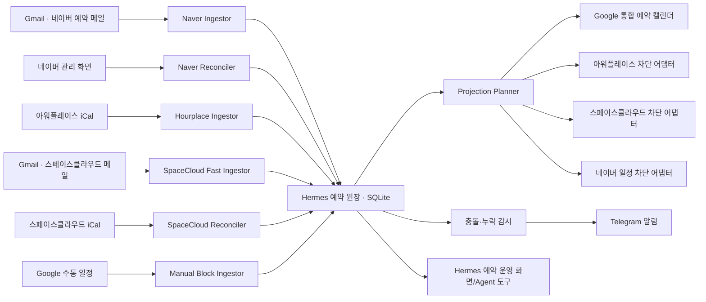

# Hermes Office 통합 예약 동기화 설계

- 문서 상태: 운영 기준 설계 · 실제 구현 진척은 `reservation-sync-implementation-status.md` 참조
- 대상 시스템: 독립 배포된 Hermes Office (`PUBLIC_ORIGIN`)
- 대상 채널: 네이버 플레이스 예약, 아워플레이스, 스페이스클라우드, Google Calendar, Telegram
- 기준 시간대: `Asia/Seoul`
- 최종 감사일: 2026-08-19

## 1. 목적과 전제

운영 공간은 네이버 플레이스, 아워플레이스, 스페이스클라우드를 서로 자동 연동하지 않고 각각 독립적인 판매 채널로 유지한다. Hermes는 각 채널의 예약을 수집해 하나의 운영 원장으로 정규화하고, 이미 예약된 시간은 나머지 채널에서 예약할 수 없도록 차단한다.

이 설계가 해결할 문제는 다음과 같다.

1. 새 예약, 변경, 취소를 가능한 한 빠르게 인식한다.
2. 세 플랫폼과 수동 예약을 한 화면에서 확인한다.
3. 한 채널에서 확정된 시간대를 다른 채널에서 차단해 중복 예약을 예방한다.
4. 새 예약, 변경, 취소, 충돌, 연동 장애를 Telegram으로 알린다.
5. 플랫폼 장애나 중복 이벤트가 발생해도 예약을 임의로 취소하거나 삭제하지 않는다.
6. 평상시 감지·동기화에는 LLM을 사용하지 않아 모델 토큰을 소비하지 않는다.

중요한 운영 전제:

- 각 플랫폼은 그 플랫폼에서 접수된 실제 예약의 최종 원본이다.
- Google Calendar는 통합 조회 및 수동 차단 입력 화면이지, 예약 원장의 최종 원본이 아니다.
- 다른 플랫폼으로 전달하는 데이터는 실제 고객 예약이 아니라 `busy block`이다.
- 결제 취소, 환불, 고객 메시지 발송, 실제 예약 취소는 자동화 범위에서 제외한다.
- 외부 플랫폼의 iCal 갱신 지연, 인증 만료, UI 변경 때문에 “항상 즉시 100%”를 기술적으로 보장할 수는 없다. 대신 지연과 누락을 감지하고 사람이 바로 조치할 수 있는 실패 안전 구조와 측정 가능한 완료 기준을 둔다.

## 2. 권장 구조



### 2.1 직접 플랫폼 간 동기화를 하지 않는 이유

예를 들어 네이버 예약을 아워플레이스에 실제 예약으로 복제하고, 아워플레이스가 그 일정을 다시 내보내면 네이버 예약이 여러 출처에서 되돌아오는 순환이 생긴다. 출처가 섞이면 변경·취소 시 어느 항목을 지워야 하는지 판별하기 어렵다.

Hermes가 단일 중재자가 되면 다음 규칙을 강제할 수 있다.

- 네이버 예약은 네이버에서만 수정·취소한다.
- 아워플레이스 예약은 아워플레이스에서만 수정·취소한다.
- 스페이스클라우드 예약은 스페이스클라우드에서만 수정·취소한다.
- 다른 채널에는 같은 시간의 예약 불가 블록만 생성한다.
- 출처 플랫폼에는 자기 예약으로 만든 블록을 다시 쓰지 않는다.

## 3. 플랫폼별 역할

| 채널 | 빠른 감지 | 최종 대조 | 다른 예약의 차단 방식 | 비고 |
|---|---|---|---|---|
| 네이버 플레이스 | Gmail 예약 메일 | 로그인된 스마트플레이스 관리 화면 | 시작–종료시간 선택형의 날짜별 `임시 운영` 가용시간 | 고객/관리자 예약 등록·취소 경로는 코드에서 제거 |
| 아워플레이스 | iCal 직접 수집 | iCal 전체 대조 | Hermes가 발행하는 필터형 iCal을 아워플레이스에서 가져오기 | 공식 가이드상 외부 iCal 가져오기와 10~30분 반영 가능 |
| 스페이스클라우드 | Gmail 예약 메일 | iCal 직접 수집 | 외부 iCal 가져오기 제공 여부를 실계정에서 우선 확인; 미지원 시 제한된 브라우저 일정 제어 | Gmail은 빠른 신호, iCal/관리 화면이 확정 근거 |
| Google Calendar | Calendar API 증분 수집 | 주기적 전체 대조 | Hermes가 API로 통합 캘린더에 반영 | 플랫폼 동기화 엔진으로 사용하지 않음 |
| Telegram | 해당 없음 | 전송 결과 저장 | 운영자 알림 | 전송 중복 방지 및 재시도 |

스페이스클라우드의 “외부 캘린더 가져오기” 기능은 계정/상품 유형별 제공 여부를 구현 전에 실제 호스트 화면에서 확인한다. iCal 내보내기만 가능하면 읽기는 iCal로 유지하고, 쓰기는 네이버와 같은 `ScheduleWriter` 방식으로 분리한다. 확인 전에는 양방향 iCal 지원을 가정하지 않는다.

## 4. 데이터 소유권과 동기화 규칙

### 4.1 원본 예약과 차단 블록

- `native booking`: 고객이 실제 플랫폼에서 결제하거나 신청한 예약
- `manual block`: 전화, Instagram, 유지보수, 개인 일정 등 운영자가 직접 등록한 차단
- `projection block`: native booking 또는 manual block을 다른 판매 채널에 투영한 예약 불가 시간

예시:

- 네이버에서 8월 20일 14:00~16:00 예약 확정
- 원장에 `origin=naver`, `kind=native_booking`으로 1건 저장
- Google 통합 캘린더에는 조회용 일정 1건 생성
- 아워플레이스와 스페이스클라우드에는 14:00~16:00 busy block 생성
- 네이버에는 추가 블록을 만들지 않음

### 4.2 상태 정규화

플랫폼별 문구는 다음 내부 상태로 변환한다.

| 내부 상태 | 의미 | 판매 시간 차단 |
|---|---|---|
| `pending` | 신청됐지만 결제·승인 확정 전 | 기본값은 차단하지 않음 |
| `confirmed` | 결제 또는 예약 확정 | 차단 |
| `changed` | 시간·상품 등이 변경된 확정 예약 | 변경된 시간으로 차단 |
| `cancelled` | 명시적으로 취소됨 | 차단 해제 후보 |
| `completed` | 이용 완료 | 과거 기록만 유지 |
| `unknown` | 파싱 또는 대조가 불완전함 | 기존 차단을 유지하고 경고 |

카드 결제 완료 시 바로 최종 예약이 되는 운영 흐름을 기본으로 하므로 `pending`은 차단하지 않는다. `confirmed` 또는 확정 예약의 변경 상태인 `changed`만 다른 채널 차단 계획에 포함한다.

### 4.3 식별자와 멱등성

원본 예약의 기본 식별 키:

```text
venue_id + source_platform + external_booking_id
```

예약 번호가 메일에 없거나 아직 파싱되지 않은 경우에만 아래 임시 지문을 사용한다.

```text
source_platform + normalized_start + normalized_end + product_code + masked_customer_hint
```

임시 지문으로 생성된 레코드는 관리 화면/iCal에서 예약 번호를 확인하면 영구 식별자로 병합한다. 동일 메일, 동일 iCal 항목, 동일 Pub/Sub 알림이 여러 번 도착해도 한 예약만 존재해야 한다.

차단 블록 UID 규칙:

```text
greeming:block:{target_platform}:{origin_platform}:{external_booking_id}:{venue_id}
```

Google 이벤트에는 결정적 event ID와 `extendedProperties.private`를 함께 넣는다.

```text
managedBy=hermes-reservation-sync
origin=naver|hourplace|spacecloud|manual
bookingKey=<opaque canonical key>
payloadHash=<normalized payload hash>
```

### 4.4 시간과 공간

- 모든 내부 시간은 UTC ISO 문자열로 저장하고 표시·계산 시 `Asia/Seoul`을 명시한다.
- 자정을 넘는 예약도 단일 반개구간 `[start, end)`으로 처리한다.
- 겹침 판정은 `startA < endB && endA > startB`를 사용한다.
- 장소가 여러 개이거나 동시에 판매 가능한 룸/세트가 있으면 `venue_id` 외에 `resource_id`를 둔다.
- 준비·정리 버퍼는 예약 시간과 분리된 정책값으로 저장한다.
- 기본 예시는 동시에 한 팀만 받는 `main-space` 단일 공간이며 준비·정리 버퍼는 앞뒤 모두 0분이다. 배포별 환경변수로 변경한다.

## 5. 저장소 설계

현재 운영 컨테이너는 Node 24 단일 프로세스이며 별도 DB가 없다. 1차 구현은 Node 24의 내장 `node:sqlite`와 WAL 모드를 사용한다. 예약 데이터는 채팅 파일과 분리된 전용 볼륨에 둔다.

권장 경로:

```text
/data/reservations/reservation-ledger.sqlite
/data/reservations/backups/
```

권장 환경 변수:

```text
RESERVATION_DATA_ROOT=/data/reservations
RESERVATION_TIME_ZONE=Asia/Seoul
RESERVATION_SYNC_ENABLED=false
RESERVATION_WRITE_MODE=shadow
```

초기 테이블:

| 테이블 | 용도 |
|---|---|
| `venues` | 장소, 룸, 시간대, 버퍼 정책 |
| `bookings` | 정규화된 native booking과 manual block |
| `booking_observations` | 이메일, iCal, 관리 화면에서 관측한 원본과 해시 |
| `projections` | 대상 플랫폼별 busy block의 희망/실제 상태 |
| `connector_checkpoints` | Gmail history ID, iCal ETag, Calendar sync token 등 |
| `jobs` | 재시도 가능한 DB 기반 작업 큐 |
| `notifications` | Telegram 중복 방지, 성공/실패, 재시도 기록 |
| `sync_runs` | 수집·대조 실행 결과와 지연 시간 |
| `audit_log` | 누가 무엇을 왜 변경했는지 append-only 기록 |

핵심 제약:

- `bookings(venue_id, source_platform, external_booking_id)` unique
- `projections(booking_id, target_platform, resource_id)` unique
- 작업 생성과 원장 갱신은 하나의 DB 트랜잭션으로 처리
- 작업자는 lease와 만료 시간을 사용해 재시작 후에도 미완료 작업을 재개
- SQLite 파일은 컨테이너 이미지가 아니라 호스트 영속 볼륨에 저장
- 일별 온라인 백업과 복원 테스트를 운영 승인 조건에 포함

단일 컨테이너를 여러 인스턴스로 수평 확장하는 시점에는 PostgreSQL로 전환한다. 현재 한 VPS·한 서비스 구성에서는 SQLite가 운영 복잡도와 장애 지점을 가장 적게 만든다.

## 6. 수집기 설계

### 6.1 Gmail 이벤트 수집

Gmail은 새 소유자가 OAuth로 연결한 예약 메일 계정의 메시지를 빠르게 감지하는 신호로 사용한다.

권장 흐름:

1. Gmail API `users.watch`를 INBOX 또는 전용 라벨에 등록한다.
2. Google Cloud Pub/Sub의 인증된 push가 Hermes webhook에 `historyId`를 전달한다.
3. Hermes는 마지막 checkpoint 이후의 history를 조회한다.
4. 허용된 발신자, 제목, 본문 형식만 플랫폼별 결정적 parser에 전달한다.
5. 예약 번호, 상태, 시작/종료, 상품을 정규화하고 원장에 upsert한다.
6. 처리한 Gmail `messageId`와 `historyId`를 저장한다.
7. `watch`는 만료 전에 매일 갱신하고, 만료/권한 실패를 Telegram으로 경고한다.

Gmail 알림은 메일 본문을 싣지 않고 변경 신호만 보내므로, 알림을 받은 뒤 Gmail API로 실제 메시지를 조회해야 한다. `historyId`가 오래되어 조회할 수 없는 경우 최근 기간을 안전하게 재스캔하고 중복은 식별 키로 제거한다.

파서는 LLM이 아니라 버전이 고정된 코드와 fixture 테스트로 구현한다. 모르는 템플릿은 임의 해석하지 않고 `unknown`으로 저장해 운영자에게 원문 링크와 함께 알린다.

### 6.2 iCal 수집

- 아워플레이스: iCal을 주 원본 수집 경로로 사용
- 스페이스클라우드: Gmail의 빠른 결과를 iCal로 대조
- 정상 주기: 2분
- 변경 메일 직후: 해당 소스 iCal을 즉시 한 번 재조회
- 정합성 전체 대조: 15분
- HTTP 조건부 요청: `ETag`, `If-Modified-Since` 사용
- 조회 범위: 과거 30일~미래 365일, 상품 특성에 따라 조정

iCal 전체 응답이 비었거나 갑자기 항목 수가 크게 줄어도 즉시 취소로 해석하지 않는다.

취소 판정 우선순위:

1. 명시적인 `STATUS:CANCELLED` 또는 취소 메일
2. 동일 UID가 연속된 정상 iCal 대조에서 사라짐
3. 관리 화면에서 취소 상태 확인

네트워크 오류, 401/403, 5xx, 파싱 실패, 비정상 빈 feed는 기존 예약과 차단을 보존한다.

### 6.3 네이버 관리 화면 대조

네이버 예약 메일은 빠른 감지에 사용하되, 메일 누락·지연을 대비해 스마트플레이스 관리 화면을 정기 대조한다.

- 우선순위 1: 공식 파트너 연동 또는 공식 API 제공 여부 확인
- 우선순위 2: 사용자 로그인 세션을 사용하는 제한된 브라우저 자동화
- 읽기 대조: 10~15분, 오류 시 기존 상태 유지
- 로그인 만료, CAPTCHA, DOM 변경 발생 시 자동 쓰기 중단 및 긴급 알림
- 비밀번호는 사용자에게 받아 저장하지 않고, 사용자가 로그인 화면에 직접 입력

브라우저 자동화가 필요한 경우 예약 목록 읽기와 일정 차단/해제 경로만 허용한다. 결제, 환불, 고객 연락, 예약 취소 버튼은 코드 수준 allowlist에서 제외한다.

### 6.4 Google 수동 일정

Google Calendar는 두 개의 캘린더로 분리한다.

1. `<RESERVATION_VENUE_NAME> 전체 예약`: Hermes만 쓰는 통합 조회 캘린더
2. `<RESERVATION_VENUE_NAME> 수동 일정`: 운영자가 전화/Instagram 예약, 촬영 불가, 유지보수 등을 입력

Hermes는 수동 일정 캘린더만 읽는다. 수동 일정의 생성·변경·삭제는 Calendar API 증분 sync token으로 1분 이내 수집하고, 그 결과를 세 플랫폼의 busy block으로 투영한다. 통합 조회 캘린더에서 사람이 일정을 편집해도 플랫폼 예약을 수정하지 않는다.

## 7. 출력 어댑터 설계

모든 플랫폼 출력기는 같은 계약을 구현한다.

```js
ScheduleWriter.ensureBlock(desiredBlock)
ScheduleWriter.updateBlock(existingRef, desiredBlock)
ScheduleWriter.removeBlock(existingRef, reason)
ScheduleWriter.readBack(existingRef)
ScheduleWriter.health()
```

공통 규칙:

- `ensureBlock`은 같은 UID가 있으면 새로 만들지 않고 갱신한다.
- 생성·변경·삭제 후 반드시 read-back으로 실제 상태를 확인한다.
- 출처 플랫폼에는 자기 예약 블록을 만들지 않는다.
- 자동화가 만든 블록만 자동으로 해제한다.
- 사람이 만든 마감, 재고 0, 실제 고객 예약은 절대 자동 해제하지 않는다.
- 쓰기 실패는 지수 backoff로 재시도하되, 예약 시작이 가까우면 긴급 알림을 보낸다.

### 7.1 필터형 iCal 발행

지원 플랫폼에는 Hermes가 다음과 같은 서명된 비공개 feed를 발행한다.

```text
/calendar/feeds/{opaque_token}/hourplace.ics
/calendar/feeds/{opaque_token}/spacecloud.ics
```

- 아워플레이스 대상 feed: 네이버 + 스페이스클라우드 + 수동 일정, 아워플레이스 예약 제외
- 스페이스클라우드 대상 feed: 네이버 + 아워플레이스 + 수동 일정, 스페이스클라우드 예약 제외

두 번째 feed는 스페이스클라우드가 외부 iCal 가져오기를 실제 지원할 때만 활성화한다. feed URL은 비밀번호에 준하는 secret이며 로그와 UI에서 전체 값을 노출하지 않는다. 유출 시 즉시 회전할 수 있도록 token version을 둔다.

아워플레이스 공식 가이드상 가져온 iCal 반영에는 최대 10~30분이 걸릴 수 있다. 따라서 이 방식만으로 즉시 차단을 보장한다고 표시하지 않으며, 반영 지연이 사업상 허용되지 않으면 쓰기 어댑터를 별도 검토한다.

### 7.2 네이버와 미지원 플랫폼 쓰기

네이버 시작–종료시간 선택형은 `간단예약관리`의 시간대 마감을 제공하지 않는다. 따라서 Hermes는 예약현황의 `예약 등록`을 사용하지 않고, 예약상품의 `일정설정 > 평상시와 다르게 예약받는 날짜`에서 판매 가능한 시간 구간만 투영한다.

날짜 단위 계산 규칙:

1. 같은 날짜의 아워플레이스·스페이스클라우드·수동 일정을 합집합으로 병합한다.
2. 네이버 기본 운영시간을 읽어 기준선과 가격·수량·시간 단위를 저장한다.
3. 기준 운영 구간에서 busy 합집합을 빼고, 최소 예약시간(현재 2시간)보다 짧은 잔여 구간을 제거한다.
4. 한 날짜에 하나의 임시 운영 설정만 저장한다. 개별 예약별로 설정을 여러 개 만들지 않는다.
5. 저장 후 다시 수정 화면을 열어 시작/마지막 시간·가격·수량을 원장 hash와 대조한다.
6. 사람이 수정해 마지막 적용 hash가 달라졌으면 덮어쓰지 않고 실패 상태로 고정한다.
7. 해당 날짜의 외부 예약이 모두 사라지면 Hermes가 만든 임시 운영 설정만 삭제해 기본 운영시간으로 복원한다.

기존에 관리자 예약으로 만들어진 차단은 원 예약의 상태가 바뀌어도 `legacy-protected`로 보존하며 자동 취소하지 않는다. 신규 차단에는 이 경로를 사용하지 않는다. 전일 차단은 날짜 1회성 휴무일로 투영한다. 이때 Hermes가 만든 날짜만 추가·제거하고, 정기휴무·공휴일·기간휴무 또는 소유권이 없는 수동 휴무일이 하나라도 감지되면 전체 휴무일 쓰기를 fail-closed로 중단한다.

안전장치:

- 처음에는 `shadow` 모드로 수행 예정 작업만 기록
- 테스트용 먼 미래 날짜에 기본 운영시간과 동일한 임시 운영을 생성 → 조회 → 삭제해 예약/가격에 영향 없는 경로를 검증
- 같은 먼 미래 날짜에 1회성 휴무일을 생성 → 조회 → 삭제하고 `휴무일 없음` 원상복구를 재확인
- selector뿐 아니라 화면 제목, 장소, 상품, 날짜, 시간, 현재 상태를 다중 확인
- 쓰기 직전 스크린샷과 계획을 audit log에 저장
- 쓰기 직후 read-back 불일치 시 더 이상 진행하지 않고 중단
- 연속 실패 한도와 회로 차단기 적용
- UI 버전 지문이 달라지면 자동 쓰기 비활성화
- 예약 등록·예약 취소·결제·환불·고객 연락 요소는 클릭 allowlist와 코드에서 제외

### 7.3 Google Calendar 중복 정책

- 통합 캘린더의 이벤트 ID는 예약 키에서 결정적으로 계산하므로 재처리해도 새 일정이 생기지 않는다.
- 아워플레이스 전송용 캘린더에는 같은 원본 예약이 별도로 1건 존재하는 것이 정상이다. Google UI 중복 표시를 막기 위해 전송용 캘린더는 CalendarList에서 자동으로 `selected=false` 처리하고, 통합 캘린더만 기본 표시한다.
- 동일 캘린더 안에서 Hermes 관리 표식과 예약 키가 같지만 결정적 ID가 아닌 이벤트만 자동 제거한다.
- 사용자가 만든 일정, 설명·참석자·링크가 있는 비관리 일정은 중복으로 판단하거나 삭제하지 않는다.

## 8. 동기화 계획기와 순환 방지

원장의 예약이 변하면 `Projection Planner`가 대상 플랫폼별 희망 상태를 계산한다.

```text
desiredTargets = allSellablePlatforms - originPlatform
```

각 projection은 다음 상태를 가진다.

```text
desired -> applying -> applied
desired -> applying -> failed -> retrying
applied -> removing -> removed
any -> conflict
```

변경 순서:

1. 새 예약을 원장에 먼저 commit
2. 같은 장소·시간의 충돌 확인
3. 대상별 projection과 outbox job 생성
4. Google 통합 이벤트 upsert
5. 판매 채널 block upsert
6. 각 대상 read-back
7. Telegram 알림 전송

예약 시간이 바뀌면 새 시간 블록을 먼저 확보한 후 이전 시간 블록을 해제한다. 새 블록 확보에 실패한 상태에서 이전 블록부터 제거하지 않는다.

취소 시에는 출처에서 취소가 확실하더라도 해당 예약이 만든 projection만 해제한다. 겹친 다른 예약이나 수동 차단이 남아 있으면 최종 busy interval은 유지한다.

## 9. 충돌 및 예외 처리

### 9.1 중복 예약 충돌

서로 다른 원본 예약의 시간 구간이 같은 `resource_id`에서 겹치면:

- 어느 예약도 자동 취소하지 않는다.
- Google 통합 캘린더에 빨간 충돌 표시를 만든다.
- Telegram으로 최우선 경고를 보낸다.
- Hermes 운영 화면에 `조치 필요` 상태로 고정한다.
- 운영자가 각 플랫폼 관리 화면에서 최종 결정을 내리고 해결 사유를 기록한다.

### 9.2 불확실한 취소

아래 상황에서는 차단을 해제하지 않는다.

- iCal이 한 번 비어 있음
- 네트워크 타임아웃
- 인증 오류
- 메일 템플릿 파싱 실패
- 관리 화면을 열지 못함
- 플랫폼이 일시적으로 예약을 누락해 반환함

잘못된 차단을 잠시 유지하는 것이 실제 예약 시간을 다시 판매해 중복 예약을 만드는 것보다 안전하다.

### 9.3 인증 만료

- Gmail/Calendar OAuth refresh 실패: Google 수집·출력만 중단, 원장과 다른 플랫폼 상태 유지
- 네이버/스페이스클라우드 브라우저 세션 만료: 해당 writer 중단, 읽을 수 있는 다른 소스는 계속 처리
- 네이버·스페이스클라우드 관리 화면은 5분마다 읽기 전용으로 확인하고 `ready`, `auth-required`, `unreachable`, `degraded`를 구분해 원장 checkpoint에 기록
- 로그인 점검과 실제 writer는 플랫폼별 동일 작업 큐와 고정 격리 세션(`reservation-naver-ops`, `reservation-spacecloud-ops`)을 사용해 동시에 같은 관리 화면을 조작하지 않음
- 고정 격리 세션은 Hermes의 `__session_target` 라우팅에 등록되며, 운영 관리의 로그인 화면 버튼과 writer가 정확히 같은 target을 사용
- `/agent-live` 직접 뷰어는 해당 세션을 passive 방식으로만 조회하므로 사용자 로그인 복구가 자동 쓰기 플래그를 우회하지 않음
- 로그인 복구 뒤 운영자의 `지금 대조` 또는 다음 5분 점검에서 상태를 다시 읽으며, 인증이 정상인 경우에만 대기 작업의 재시도를 허용
- iCal URL 401/403: URL 유출/회전/만료 가능성을 긴급 알림
- Telegram 실패: 알림을 DB outbox에 보존하고 재시도하며 Hermes UI에도 같은 경고 표시

## 10. Telegram 알림 정책

기본 알림 종류:

- 새 예약 접수/확정
- 예약 시간 또는 상품 변경
- 명시적 취소
- 중복 예약 충돌
- 타 플랫폼 차단 실패 또는 반영 지연
- Gmail watch, OAuth, iCal, 브라우저 세션 만료
- 매일 1회 동기화 건강 상태 요약

예시:

```text
[예약 확정 · 네이버]
일시: 2026-08-20 14:00~16:00
장소: <RESERVATION_VENUE_NAME> / <RESERVATION_RESOURCE_ID>
동기화: Google 완료 · 아워플레이스 대기 · 스페이스클라우드 완료
예약번호: NAV-••••1234
```

알림에는 기본적으로 고객 전체 이름, 전화번호, 결제 상세를 넣지 않는다. 꼭 필요하다면 별도 승인을 받고 최소 정보만 표시한다. 같은 `event_type + booking_id + revision`은 한 번만 발송한다.

## 11. Hermes Office 통합

예약 기능은 기존 Google Drive mirror 및 Hermes agent proxy와 분리된 모듈로 추가한다.

권장 파일 구조:

```text
reservationSync/
├─ index.js
├─ config.js
├─ ledger.js
├─ scheduler.js
├─ planner.js
├─ conflictDetector.js
├─ notificationOutbox.js
├─ connectors/
│  ├─ gmail.js
│  ├─ googleCalendar.js
│  ├─ hourplaceIcal.js
│  ├─ spacecloudIcal.js
│  └─ naverDashboard.js
├─ writers/
│  ├─ filteredIcal.js
│  ├─ naverScheduleWriter.js
│  └─ spacecloudScheduleWriter.js
└─ parsers/
   ├─ naverEmail.js
   ├─ spacecloudEmail.js
   └─ ical.js
```

서버 연결 지점:

- `startReservationSync()`를 서버 부팅 시 한 번 실행
- `/bridge/reservations/*`는 기존 Office 로그인 보호 아래 제공
- `/webhooks/google/gmail`만 Pub/Sub OIDC 검증 후 로그인 없이 수신
- `/calendar/feeds/*`는 opaque token과 rate limit으로 보호
- `/healthz`와 별도로 connector별 마지막 성공 시간, lag, 실패 수를 제공

Agent 연동은 탐지 자체가 아니라 운영 조회와 설명에 사용한다. 각 Hermes 프로필은 Native MCP의
`mcp_greeming_calendar_calendar_events`를 통해 Office의 읽기 전용 broker를 호출한다.

- 기본 조회 대상은 중복이 없는 `integrated` 캘린더
- 필요 시 `manual`, `hourplace`를 명시적으로 조회
- 조회 범위 최대 93일, 응답 최대 250건
- 제목·시간·상태·원본 플랫폼만 반환하고 description, 참석자, 링크, 원본 Google event ID는 반환하지 않음
- Agent 프로필과 조회 범위를 감사 로그에 기록
- Agent는 일정 생성·수정·삭제 도구를 받지 않음

예약 감지와 차단은 deterministic background worker가 수행하므로 Agent 대화 세션이 닫혀 있어도 계속 작동하고 모델 토큰을 사용하지 않는다.

## 12. OAuth와 secret 분리

현재 `google_office_readonly_token.json`은 Google Drive 읽기 전용 mirror용이다. 이 토큰의 범위를 넓히거나 예약 기능에 재사용하지 않는다.

예약 전용 인증을 별도로 둔다. 예약 데이터와 OAuth 파일은 Agent의 `/opt/data` 공유 mount 밖인
프로젝트별 `office-reservations` Docker volume에 보관하고 Office 컨테이너에만 mount한다.

```text
/run/secrets/google_reservation_oauth_token.json
/run/secrets/google_reservation_client_secret.json
/run/secrets/telegram_reservation.json
```

필요 최소 권한:

- Gmail: `gmail.readonly`
- Google Calendar: 지정 캘린더의 이벤트 읽기/쓰기 범위
- Pub/Sub: Gmail topic 게시 권한과 인증된 push 구독

추가 원칙:

- secret은 Git, 이미지, 로그, Google Drive 자료실에 넣지 않음
- Agent에는 Calendar OAuth refresh token 대신 범위가 제한된 broker token만 제공
- Docker read-only secret mount 사용
- OAuth refresh token은 파일 권한을 제한하고 백업도 암호화
- iCal URL, Telegram bot token, booking ID 원문은 구조화 로그에서 마스킹
- 캘린더 제목에는 개인 식별 정보를 넣지 않음
- 운영자 화면의 민감 정보는 필요 시에만 펼쳐서 표시하고 접근 감사 기록을 남김

## 13. 성능과 운영 목표

| 항목 | 목표 |
|---|---|
| Gmail 기반 새 예약 감지 | Pub/Sub 수신 후 60초 이내 p95 |
| iCal 전용 예약 감지 | 원본 feed가 갱신된 뒤 5분 이내 p95 |
| Google 수동 일정 감지 | 2분 이내 p95 |
| Telegram 발송 | 원장 반영 후 30초 이내 p95 |
| 동일 이벤트 중복 알림 | 0건 |
| 자동화에 의한 실제 예약 취소/환불 | 0건 |
| 재시작 후 미완료 job 재개 | 2분 이내 |
| connector 상태 대조 | 15분마다 |
| 브라우저 writer 로그인·관리 UI 점검 | 5분마다 |

iCal을 가져가는 외부 플랫폼 자체의 10~30분 반영 지연은 Hermes의 내부 처리 목표와 별개로 관측해 UI에 표시한다.

## 14. 구현 단계와 단계별 승인 기준

미완성 상태에서 다음 단계로 넘어가지 않도록 각 단계마다 통과 조건을 둔다.

### Phase 0. 실계정 기능 감사

작업:

- 세 플랫폼의 예약 유형, 상품, 룸, 상태 전이 확인
- 아워플레이스/스페이스클라우드 iCal 샘플과 UID 안정성 확인
- 스페이스클라우드 외부 iCal 가져오기 여부 확인
- 네이버 공식 연동 가능 여부와 일정 마감 UI 확인
- Gmail의 실제 예약·변경·취소 메일 샘플 확보

통과 조건:

- 플랫폼별 읽기 원본과 쓰기 수단이 표로 확정됨
- 예약 번호, 시간, 상태를 추출할 수 있는 샘플이 각각 준비됨
- 자동화 금지 버튼과 허용 경로가 문서화됨

### Phase 1. 원장과 parser

작업:

- SQLite schema, migration, backup 구현
- Gmail/iCal parser와 정규화 구현
- DB job/outbox, 멱등성, 충돌 검출 구현

통과 조건:

- 중복·순서 뒤바뀜·재시작 테스트 통과
- 실제 샘플에서 예약 생성/변경/취소가 정확히 재현됨
- 잘못된/새 템플릿을 `unknown`으로 안전 격리함

### Phase 2. 읽기 전용 shadow 운영

작업:

- Gmail push, iCal poll, Google 통합 캘린더 출력
- Telegram은 테스트 채팅 또는 silent 모드
- 타 플랫폼 차단은 수행하지 않고 예정 작업만 기록

통과 조건:

- 최소 7일 또는 각 플랫폼 테스트 예약 3종(생성·변경·취소) 대조
- 실제 관리 화면과 원장 차이 0건
- 중복 Telegram 0건
- 인증 만료와 빈 iCal 테스트에서 예약 보존 확인

### Phase 3. 아워플레이스 차단

작업:

- Hermes filtered iCal 발행
- 먼 미래 테스트 예약으로 생성·변경·해제
- 외부 반영 지연 측정

통과 조건:

- 자기 출처 제외와 순환 방지 검증
- 실제 반영 read-back 성공
- 사람이 만든 마감이 보존됨

### Phase 4. 스페이스클라우드 차단

작업:

- 확인된 capability에 따라 filtered iCal 또는 ScheduleWriter 구현
- 생성·변경·해제와 세션 만료 검증

통과 조건:

- Phase 3과 같은 안전 기준 통과
- Gmail 선행 신호와 iCal 최종 대조가 일치

### Phase 5. 네이버 차단

작업:

- 공식 연동 가능 시 공식 방식 우선
- 필요 시 브라우저 writer를 최소 권한으로 구현
- 사용자 감독 아래 테스트 날짜 한 건 검증

통과 조건:

- 블록 생성·변경·해제 후 관리 화면 read-back 일치
- CAPTCHA/로그인 만료/화면 변경 시 쓰기가 fail-closed
- 예약 취소·결제·환불 경로에 접근하지 않음을 테스트로 보장

### Phase 6. 운영 UI와 전체 전환

작업:

- Hermes 예약 현황, connector 건강 상태, 충돌함, 감사 로그 화면
- 1개 채널씩 `shadow` → `write` 전환
- 백업·복원 및 장애 대응 runbook 확정

통과 조건:

- 세 플랫폼 생성·변경·취소 end-to-end 시나리오 통과
- 동시 예약, 자정 통과, 버퍼, 재시작, 외부 장애 테스트 통과
- 운영자가 UI와 Telegram만으로 누락·지연·충돌을 판단할 수 있음

## 15. 필수 테스트 목록

### 단위/계약 테스트

- 플랫폼별 실제 이메일 fixture 파싱
- iCal UID, 변경 시퀀스, 취소, 반복 일정, 시간대
- 상태 매핑과 blocking policy
- 결정적 event ID와 payload hash
- 자기 출처 제외 및 projection 계산
- 겹침과 버퍼 계산
- PII 마스킹과 secret 로그 차단

### 통합 테스트

- Gmail Pub/Sub 중복/순서 뒤바뀜/history gap
- iCal 304, 빈 응답, 401, 500, timeout, 깨진 ICS
- Calendar insert 성공 후 응답 유실 시 재시도
- Telegram 429와 네트워크 실패 재시도
- DB commit 직후 프로세스 종료와 복구
- 예약 변경 시 새 블록 우선 확보
- 취소 시 다른 겹친 블록 보존

### 브라우저/E2E 테스트

- 네이버는 고객/관리자 예약을 생성·취소하지 않고, 먼 미래의 동일 운영시간 임시 설정 생성 → read-back → 원상복구
- 시간 변경은 fixture와 가상 adapter로 새 가용시간 우선 적용 → 이전 구간 복원 검증
- 명시적 취소 fixture는 해당 projection만 안전 해제하고 실제 플랫폼 예약에는 쓰지 않음
- 동시 두 플랫폼 예약 → 자동 취소 없이 충돌 경고
- 로그인 만료/CAPTCHA/DOM 변경 → fail-closed
- 모바일/데스크톱 Hermes 운영 UI 확인

## 16. 구현 전에 필요한 사용자 제공 사항

secret은 채팅에 붙여넣지 않고 서버 secret 파일 또는 OAuth 로그인 화면으로만 제공한다.

1. 아워플레이스에서 발급한 iCal 내보내기 URL
2. 스페이스클라우드에서 발급한 iCal 내보내기 URL
3. 예약 메일을 받는 Google 계정의 예약 전용 OAuth 동의
4. Google Calendar의 `전체 예약`, `수동 일정` 캘린더 생성 또는 생성 승인
5. Telegram 알림 대상 chat ID와 전용 bot 사용 여부
6. 네이버/스페이스클라우드 관리 화면에 사용자가 직접 로그인한 세션
7. 실제 장소·룸·상품 구조와 동시에 받을 수 있는 예약 수(확정: `default-space` 단일 공간, 한 팀)
8. 다음 운영 정책 결정
   - `pending` 상태 차단 여부(확정: 미차단, 카드 결제 완료 예약만 차단)
   - 예약 전후 준비·정리 버퍼 시간(확정: 각각 0분)
   - Telegram에 표시할 고객 정보 범위
   - iCal 반영이 10~30분 걸릴 때 허용 가능한 최대 지연
9. 네이버는 실제 예약 생성·취소 테스트를 금지하고, 무영향 임시 운영시간 테스트만 허용

현재 확정 정책은 `pending` 미차단, 고객 정보 최소 표시, 자동 취소/환불 금지, 안전하지 않은 취소 판정 시 기존 블록 유지다.

## 17. 공식 근거

- [Gmail API push 알림 구성](https://developers.google.com/workspace/gmail/api/guides/push)
- [Gmail `users.watch` 참조](https://developers.google.com/workspace/gmail/api/reference/rest/v1/users/watch)
- [Google Calendar 이벤트 생성](https://developers.google.com/workspace/calendar/api/guides/create-events)
- [Google Calendar extended properties](https://developers.google.com/workspace/calendar/api/guides/extended-properties)
- [아워플레이스 캘린더 연동 가이드](https://docs.channel.io/hosting-guide/ko/articles/-%EC%BA%98%EB%A6%B0%EB%8D%94-%EC%97%B0%EB%8F%99-%EA%B0%80%EC%9D%B4%EB%93%9C-7813ec33)
- [네이버 시작–종료시간 선택형 예약 상품·일정 설정](https://help.naver.com/service/11712/contents/17334?lang=ko)
- [네이버 예약 마감·비활성 점검](https://help.naver.com/service/11712/contents/23189?osType=COMMONOS)
- [네이버 휴무일·임시영업 설정](https://help.naver.com/service/11712/contents/7602?lang=ko)
- [네이버 예약 브레이크 타임 설정](https://help.naver.com/service/11712/contents/17577?lang=ko&osType=COMMONOS)

## 18. 최종 결정 요약

1. `iCal vs Gmail` 중 하나만 고르지 않고 빠른 신호와 최종 대조를 분리한다.
2. 스페이스클라우드는 Gmail로 빠르게 감지하고 iCal로 대조한다.
3. 아워플레이스는 iCal을 주 수집원으로 사용한다.
4. 네이버는 Gmail로 빠르게 감지하고 관리 화면으로 누락을 대조한다.
5. Google Calendar는 통합 조회와 수동 차단 입력용으로만 사용한다.
6. Hermes의 SQLite 예약 원장이 동기화 판단과 감사의 중심이다.
7. 플랫폼에는 다른 채널의 실제 예약을 복제하지 않고 busy block만 투영한다.
8. 모든 자동 쓰기는 shadow 운영, 무영향 테스트 날짜 검증, read-back을 통과한 뒤 단계별 활성화한다.
9. 감지·동기화·알림의 정상 경로에는 LLM을 사용하지 않는다.
10. 실제 예약 취소, 결제 취소, 환불은 자동화하지 않는다.
